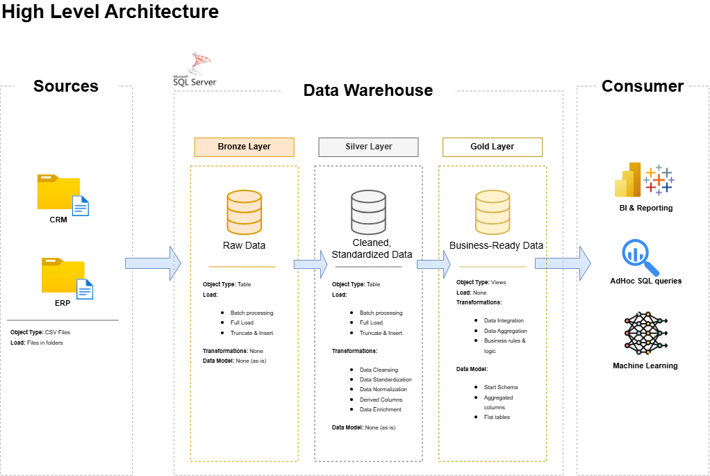

# **SQL Data Warehouse Project**

A hands-on data engineering project built to design and implement a modern data warehouse using SQL Server, following the Medallion Architecture (Bronze, Silver, Gold). This project consolidates sales data from ERP and CRM source systems into a single, analytics-ready model.

This project was built as part of my transition into data engineering. I followed Data With Baraa's SQL Data Warehouse tutorial as a base, then rebuilt key pieces independently to deepen my understanding of the underlying concepts rather than just following along.

## 🏗️ **Architecture**

The warehouse is structured into three layers:



Bronze — Raw data, loaded as-is from source CSV files (ERP and CRM systems), with no transformation. This preserves an unaltered copy of the source data for traceability and reprocessing.

Silver — Cleansed, standardized, and normalized data. This is where data quality issues from the source systems get resolved.

Gold — Business-ready data modeled into a star schema, optimized for reporting and analytical queries.


## 🎯 **Project Goals**


Consolidate ERP and CRM sales data into a single, query-friendly model
Resolve data quality issues prior to analysis
Design fact and dimension tables optimized for analytical queries
Produce SQL-based insights into customer behavior, product performance, and sales trends


## 🛠️ **Tech Stack**


SQL Server / T-SQL
Medallion Architecture (Bronze / Silver / Gold)
Star schema data modeling


## 📂 **Repository Structure**
```
sql-data-warehouse-project/
│
├── datasets/          # Raw ERP and CRM source data (CSV)
├── docs/               # Architecture diagrams and documentation
├── scripts/
│   ├── bronze/         # Raw data ingestion scripts
│   ├── silver/         # Data cleansing and transformation scripts
│   ├── gold/            # Star schema / analytical model scripts
├── tests/               # Data quality checks
└── README.md
```
## 📌 **Key Design Decisions & What I Learned**

A few of the concepts I worked to properly understand while building this, rather than just copying the code:


**Idempotency:** The setup script drops and recreates the database on every run, so it can be executed repeatedly and always land in the same clean state, rather than relying on error-handling to avoid duplicate objects.

**SQL Server batch execution:** Understanding how GO separates statements into batches, and why some statements (like CREATE SCHEMA) must be isolated in their own batch, or the script won't compile.

**Why separate layers physically:** Keeping raw (Bronze), cleaned (Silver), and business-ready (Gold) data in distinct schemas rather than transforming data in place, so raw source data is always recoverable, and each layer's purpose stays clear.

**DDL vs. DML:** Distinguishing structural setup (creating databases/schemas) from data loading patterns (like truncate-and-insert), which serve different purposes in the pipeline.

**Data architecture tradeoffs:** Understanding the differences between data architecture approaches (e.g. Medallion vs. others) and the reasoning behind when one is a better fit than another, rather than treating it as a fixed template.

**Star schema vs. snowflake schema:** Understanding the structural difference between the two and the tradeoffs involved (query simplicity and performance vs normalisation and storage efficiency).

**Fact tables vs. dimension tables:** Understanding the distinction between tables that store measurable business events (facts) and tables that store descriptive context around those events (dimensions), and how they connect in a star schema.

**Hands-on ETL experience:** Beyond the theory, actually building and running extract-transform-load pipelines end-to-end, which surfaced practical issues (data quality, sequencing, batch execution) that reading alone never would have.


## 🚀 **How to Run**


Clone this repository
Run the scripts in scripts/ in order: database/schema setup → bronze layer → silver layer → gold layer
Source CSVs are located in datasets/


## 🙏 **Acknowledgements**

This project was built following the excellent SQL Data Warehouse tutorial by Data With Baraa. I highly recommend it as a starting point for anyone learning data warehousing fundamentals.

## 📬 **Contact Me**

Feel free to connect or reach out — I'm always happy to talk data engineering:


LinkedIn: www.linkedin.com/in/jabulileshongwe
Email: jshongwe394@gmail.com
Website: 


## 📄 License

This project is for portfolio and educational purposes.
